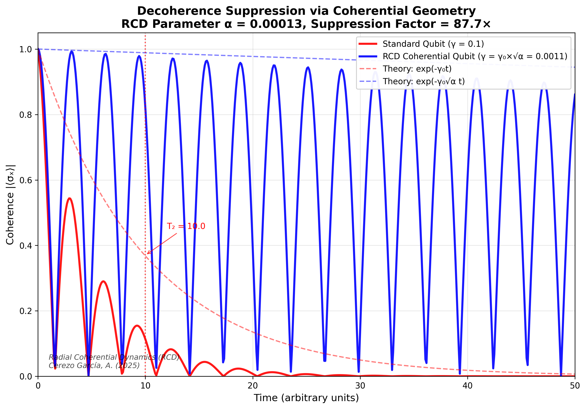

# **Arturo Cerezo García**
### *Independent Researcher — Theoretical Physics*

---

## **Radial Coherential Dynamics (RCD)**
### *Coherence as a Physical Regulator of Spacetime*

Radial Coherential Dynamics (RCD) is a theoretical framework proposing that **coherence is a fundamental physical regulator**, governing effective coupling strengths, decoherence rates, and emergent spacetime structure.

The framework introduces a universal coherential parameter:

\[
\alpha \approx 1.3 \times 10^{-4}
\]

with physical effects scaling as:

\[
g_{\mathrm{eff}} \propto \sqrt{\alpha}
\]

RCD yields **quantitative, falsifiable predictions** across quantum information, decoherence dynamics, and cosmology.

---

## **Key Result — Quantum Decoherence Suppression (2025)**

### **Topological Decoherence Suppression via Coherential Geometry**

**Preprint (Zenodo)**  
**DOI:** https://doi.org/10.5281/zenodo.18000641  

This work predicts that a coherentially coupled qubit experiences a **suppression of decoherence by a factor of ~87.7×**, relative to a standard qubit under identical environmental coupling.

The effective dephasing rate obeys:

\[
\gamma_{\mathrm{RCD}} = \gamma_0 \sqrt{\alpha}
\]

Numerical simulations (QuTiP) confirm this scaling under pure dephasing conditions, yielding:

\[
T_2^{\mathrm{RCD}} \approx 877\,\mu s \quad (\text{vs } T_2 = 10\,\mu s)
\]

This prediction is **testable on current superconducting and trapped-ion platforms**.

**Repository contents:**
- Peer-readable preprint (PDF + Markdown)
- Reproducible numerical simulation code
- High-resolution figures for experimental comparison

---

## **Foundational Framework**

### **Primordial Coherence as a Physically Plausible Initial Condition**
*Zenodo Preprint (2025)*  

**DOI:** https://doi.org/10.5281/zenodo.17644233  

This work proposes **C₀ = 1 (absolute coherence)** as the Universe’s initial condition, prior to spacetime or geometry.  
Spacetime curvature, decoherence gradients, and temporal asymmetry emerge from deviations in coherence:

\[
\nabla \Phi_c = -k_c (1 - C)
\]

---

## **Research Scope**
- Quantum decoherence and coherence geometry  
- Quantum information & error suppression  
- Emergent spacetime and pre-geometric physics  
- Foundations of cosmology  
- Testable beyond-Standard-Model phenomenology  

---

## **Open Science Commitment**
All results are released as **open-access preprints**, with **reproducible code and figures**.  
RCD is presented as a falsifiable framework intended for independent verification.

---

## **Contact**
For research correspondence or experimental collaboration:  
**juridicocerezo@juridicocerezo.com**

---

### **“Coherence is not the order of the Universe — it is the memory of its unity.”**  
🌌

